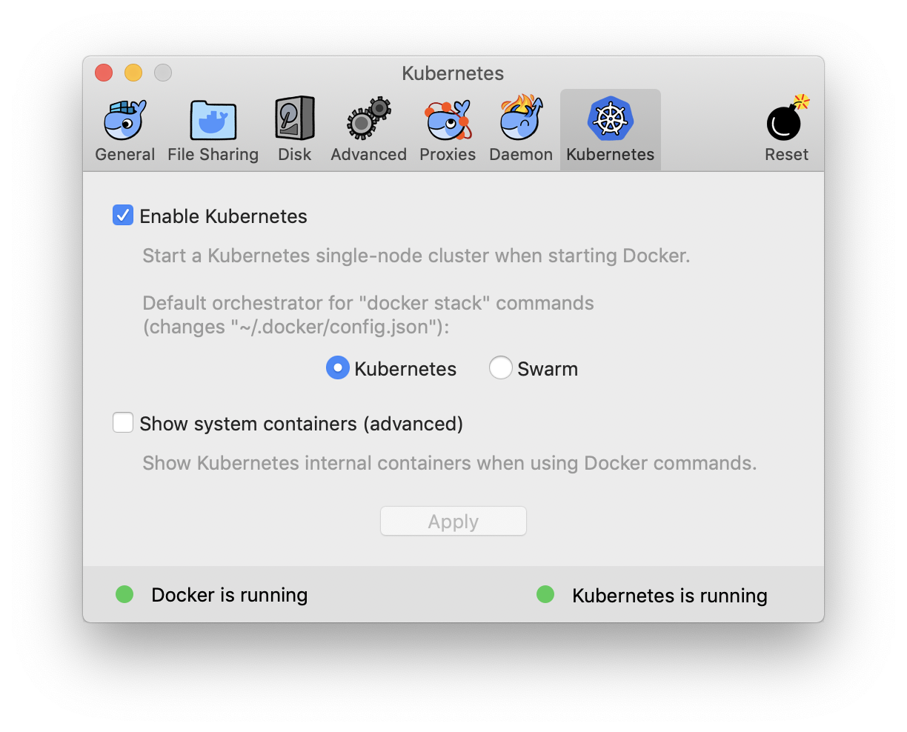
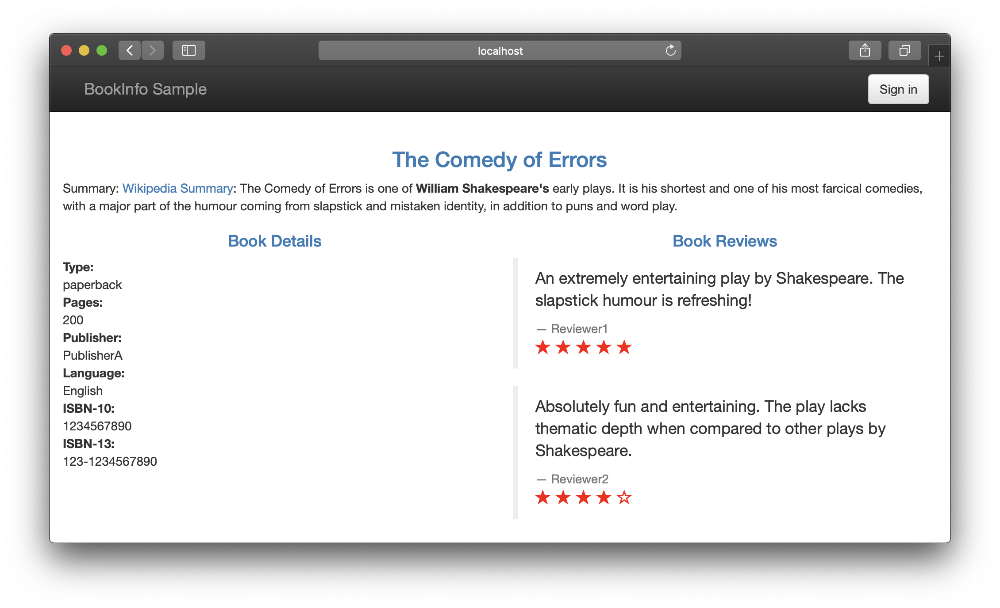

# Istio Demo

## 순서

1. Kubernetes 설치 (Docker for mac)
2. Istio 설치 (Control Plane + add-on)
3. Demo Web application 설치
4. 설정 데모
5. Add-on 소개

## Kubernetes 설치

Docker for mac에서 제공하는 kubernetes 기능을 활성화 합니다.



## Istio 설치

**istio 프로그램 다운로드**

```bash
$ curl -L https://git.io/getLatestIstio | ISTIO_VERSION=1.0.3 sh -
$ cd istio-1.0.3
$ export PATH=$PWD/bin:$PATH
```

**istio 설치**

kubernetes cluster에 istio 배포

```bash
$ kubectl apply -f crds.yaml -f istio-demo-auth.yaml
```

**istio 설치 확인**

```bash
$ kubectl get pods -n istio-system
```

```txt
NAME                                      READY     STATUS      RESTARTS   AGE
grafana-9cfc9d4c9-pwsh6                   1/1       Running     0          6m
istio-citadel-6d7f9c545b-p7fk7            1/1       Running     0          6m
istio-cleanup-secrets-sq7cl               0/1       Completed   0          7m
istio-egressgateway-75dbb8f95d-zg5cw      1/1       Running     0          6m
istio-galley-6d74549bb9-5gzdl             1/1       Running     0          6m
istio-grafana-post-install-btvwm          0/1       Completed   0          7m
istio-ingressgateway-6bd4957bc-fq6rr      1/1       Running     0          6m
istio-pilot-7f8c49bbd8-5r6pt              2/2       Running     0          6m
istio-policy-6c65d8cff4-l42sz             2/2       Running     0          6m
istio-security-post-install-pqv97         0/1       Completed   0          7m
istio-sidecar-injector-74855c54b9-p5t6w   1/1       Running     0          6m
istio-telemetry-65cdd46d6c-x4nbk          2/2       Running     0          6m
istio-tracing-ff94688bb-9nm8j             1/1       Running     0          6m
prometheus-f556886b8-rhg9t                1/1       Running     0          6m
servicegraph-778f94d6f8-gfzdm             1/1       Running     0          6m
```

## Demo Web application 설치

**demo 실행**

- [bookinfo.yaml](bookinfo.yaml)
- [injected-bookinfo.yaml](injected-bookinfo.yaml)

```bash
$ istioctl kube-inject -f bookinfo.yaml | kubectl apply -f -
```

**demo 확인**

```bash
$ kubectl get pod
```

```txt
NAME                              READY     STATUS    RESTARTS   AGE
details-v1-847d88f764-h74ws       2/2       Running   0          1m
productpage-v1-6857c89c7d-xjc5w   2/2       Running   0          1m
ratings-v1-bfc5c8ff6-p2lct        2/2       Running   0          1m
reviews-v1-dbfdf6897-tbs95        2/2       Running   0          1m
reviews-v2-79c66bbdd-xwgff        2/2       Running   0          1m
reviews-v3-559fc7cb59-bqsk9       2/2       Running   0          1m
```

**gateway 설정** ([bookinfo-gateway.yaml](bookinfo-gateway.yaml))

```bash
$ kubectl apply -f bookinfo-gateway.yaml
```

**웹페이지 확인**

http://localhost/productpage



## 설정 데모

**destination rule 설정** ([destination-rule-all-mtls.yaml](destination-rule-all-mtls.yaml))

```bash
$ kubectl apply -f destination-rule-all-mtls.yaml
```

**9:1 가중치** ([virtual-service-reviews-90-10.yaml](virtual-service-reviews-90-10.yaml))

```bash
$ kubectl apply -f virtual-service-reviews-90-10.yaml
```

**tom user 분기처리** ([virtual-service-reviews-tom-v2-v3.yaml](virtual-service-reviews-tom-v2-v3.yaml))

```bash
$ kubectl apply -f virtual-service-reviews-tom-v2-v3.yaml
```

**fault injection** ([virtual-service-ratings-test-delay.yaml](virtual-service-ratings-test-delay.yaml))

```bash
$ kubectl apply -f virtual-service-ratings-test-delay.yaml
```

**retry** ([virtual-service-reviews-test-timeout.yaml](virtual-service-reviews-test-timeout.yaml))

```bash
$ kubectl delete virtualservice reviews
$ kubectl apply -f virtual-service-reviews-test-timeout.yaml
```

## Add on

**prometheus** (http://localhost:9090)

```bash
$ kubectl -n istio-system port-forward $(kubectl -n istio-system get pod -l app=prometheus -o jsonpath='{.items[0].metadata.name}') 9090:9090
```

**grafana** (http://localhost:3000)

```bash
$ kubectl -n istio-system port-forward $(kubectl -n istio-system get pod -l app=grafana -o jsonpath='{.items[0].metadata.name}') 3000:3000
```

**jagger** (http://localhost:16686)

```bash
$ kubectl port-forward -n istio-system $(kubectl get pod -n istio-system -l app=jaeger -o jsonpath='{.items[0].metadata.name}') 16686:16686
```

**service graph** (http://localhost:8088/dotviz)

```bash
$ kubectl -n istio-system port-forward $(kubectl -n istio-system get pod -l app=servicegraph -o jsonpath='{.items[0].metadata.name}') 8088:8088
```

- /force/forcegraph.html D3.js를 이용한 시각화
- /dotviz Graphviz를 이용한 시각화
- /dotgraph DOT 형태로 시각화
- /d3graph D3 라이브러리를 위한 JSON 결과
- /graph JSON 형태의 결과

## cleanup

```
$ istioctl kube-inject -f bookinfo.yaml | kubectl delete -f -
$ kubectl delete -f istio-demo-auth.yaml
$ kubectl delete -f crds.yaml
```
